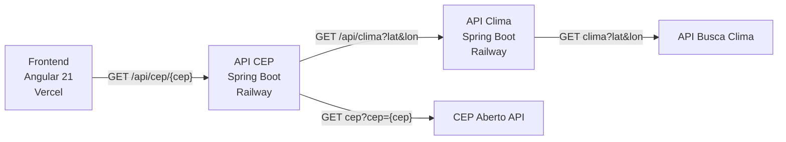

# CEP & Clima - Projeto Microserviços

Aplicação fullstack que busca dados de endereço a partir de um CEP e retorna o clima correspondente à localização.

🔗 **[Acesse o projeto ao vivo](https://projeto-spring-cep-clima.vercel.app)**

---

## Arquitetura



---

## Tecnologias

| Camada | Tecnologia |
|--------|-----------|
| Frontend | Angular 21, TypeScript, HTML, CSS |
| Backend | Java, Spring Boot, Docker, Spring Cloud OpenFeign |
| Deploy Frontend | Vercel |
| Deploy Backend | Railway |
| APIs Externas | CEP Aberto, API Busca Clima |

---

## Estrutura do Projeto

```
Projeto_Spring_Cep_Clima/
├── Projeto_Spring_MicroS_Cep/       # Microserviço de busca de CEP
├── Projeto_Spring_MicroS_Clima/     # Microserviço de busca de Clima
└── Projeto_Spring_MicroS_Front/     # Frontend Angular
    └── cep-clima-front/
```

---

## O que já está pronto

- [x] Microserviço de CEP integrado com a API CEP Aberto (OpenFeign)
- [x] Microserviço de Clima integrado com API externa (OpenFeign)
- [x] Frontend Angular com busca por CEP (Aprofundar Conhecimento)
- [x] Exibição de dados de endereço e clima
- [x] Deploy das APIs separadas no Railway
- [x] Deploy do Frontend no Vercel
- [x] Variáveis de ambiente com `@ngx-env/builder`
- [x] Variáveis de ambiente no backend com DotEnv
- [x] CORS configurado nos backends (Aprofundar Conhecimento)
- [x] Documentação das APIs com Swagger/OpenAPI
- [x] Criação de DockerFile para ambas APIs

---

## O que ainda falta fazer

- [ ] Criação de API de Orquestração
- [ ] Tratamento de erros amigável no frontend (CEP inválido, API fora do ar)
- [ ] Loading spinner durante as requisições
- [ ] Testes unitários no backend(Junit + Mockit) para a API CEP
- [ ] Testes unitários no frontend (Vitest)
- [ ] Validação de formato do CEP antes de enviar a requisição
- [ ] Responsividade mobile no frontend
- [ ] Melhorar mensagens de erro da API (padronizar responses)
- [ ] Criar YAML p/ automatizar CI/CD (GitHub Actions)
- [ ] Proteção das rotas da API (API Key ou JWT)

---

## Como rodar localmente

### Backend (CEP e Clima)

```bash
# Na pasta de cada microserviço
./mvnw spring-boot:run
```

### Frontend

```bash
cd Projeto_Spring_MicroS_Front/cep-clima-front
npm install
ng serve
```

Crie o arquivo `src/environments/environment.development.ts`:

```typescript
export const environment = {
  production: false,
  apiUrl: 'http://localhost:8080'
};
```

---

## 🌐 Deploy

| Serviço | Plataforma | URL |
|---------|-----------|-----|
| Frontend | Vercel | https://projeto-spring-cep-clima.vercel.app |
| API CEP | Railway | https://apibuscacep-production.up.railway.app |
| API Clima | Railway | https://apibuscaclima-production.up.railway.app |
